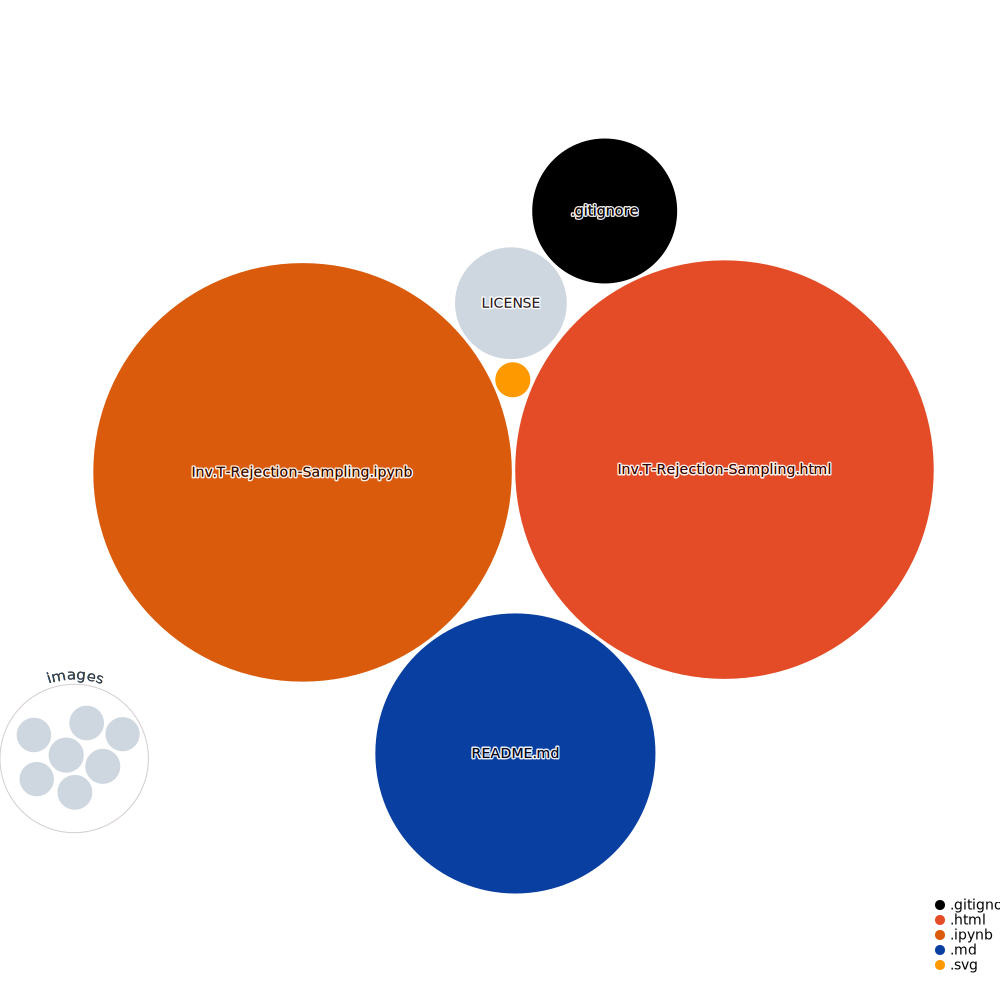
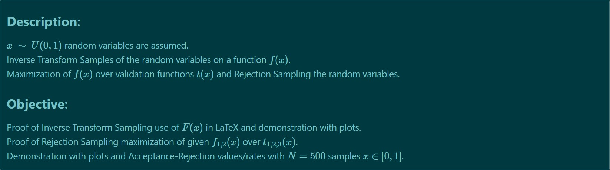

## **Inverse Transform & Rejection Sampling**   

 <i>Repository Tools:</i> 

  
##### Actions:   
##### Main Text-Editor:     
##### Language:         
##### Libraries:     
##### Web-Interface:   
##### Version Control:     
  

##### License:&nbsp;

 <i>Contact:</i> 

   

 

 <i>Repository Visualization:</i> 

  
 

  

 <b>Results:</b> 

1. $f_1(x)$ over validation function $t_1(x)$ with *scipy* `optimize.fmin`. 

  

<i>(see nbviewer in <b>Repo Visualization 2-3</b>)</i> 
2. Maximization arg max. in LaTeX  
3. Inverse Transform Method in LaTeX.  
4. Inverse Transform Method with `matplotlib`. 

5. Acceptance-Rejection Method within $f_1(x)$ over $t_1(x)$. 

<b>Rejected values are: 0.256</b>  

6. Acceptance-Rejection Method of $f_1(x)$ over $t_2(x)$. 

<b>Rejected values are: 0.486</b>  

7. Acceptance-Rejection Method of $f_2(x)$ over $t_1(x)$ and $f_2(x)$ over $t_3(x)$. 

 
<b>Rejected values are: 0.446</b> 
  

 
<b>Rejected values are: 0.506</b> 
 
<i>Note: Random values generated are slightly different per execution. </i>

###### Considerations:
+ <i>Rejection sampling can be used with any $f(x)$.</i>
+ <i>Proposing $t(x)$ can be hard.</i> 

#### References: 
[`scipy.optimize.fmin`](https://docs.scipy.org/doc/scipy/reference/generated/scipy.optimize.fmin.html)  
[`np.random.rand`](https://numpy.org/doc/stable/reference/random/generated/numpy.random.rand.html)  
[`np.random.uniform`](https://numpy.org/doc/stable/reference/random/generated/numpy.random.uniform.html)  
[Inverse-transform-sampling](https://en.wikipedia.org/wiki/Inverse_transform_sampling) 
[Rejection-sampling](https://en.wikipedia.org/wiki/Rejection_sampling)  

